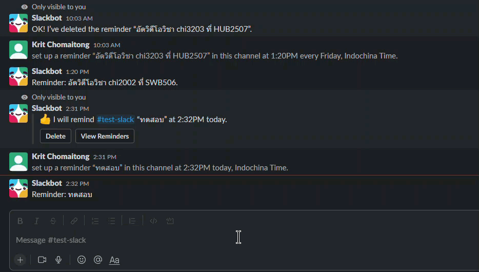
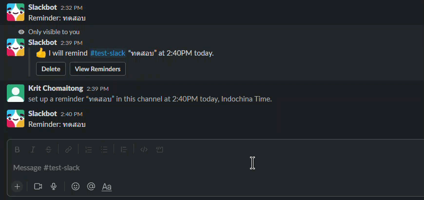

# 13. การแจ้งเตือน 🔔

## คำสั่งแจ้งเตือน

[[001-slack-คืออะไร|Slack]] มีคำสั่งที่ช่วยให้เราสามารถแจ้งเตือนงาน หรือนัดหมาย โดยมีรูปแบบคำสั่งดังนี้ เริ่มแรกพิมพ์ 

```
/remind
```


ก็จะมีรูปแบบคำสั่งอธิบายขึ้นมา

```
/remind [@someone or #channel] [what] [when]
```

1. `/remind` คือคำสั่ง
2. `@someone` or `#channel` คือกลุ่มเป้าหมายที่จะให้แสดงการแจ้งเตือน
3. `what` คือ คำพูดหรือประโยคที่จะแสดงเวลาแจ้งเตือน 
4. `when` คือ จะให้แจ้งเตือนเมื่อไร 

ยกตัวอย่างเช่น 

```
/remind #test-slack "อัดวิดีโอวิชา chi3203 ที่ HUB2507" Every Friday at 01:20pm
```

1. `/remind` คือคำสั่ง
2. `\#test-slack` คือ channel ที่จะแจ้งเตือน
3. `อัดวิดีโอวิชา chi3203 ที่ HUB2507` ใส่ เครื่องหมาย  "  ครอบเอาไว้เพื่อบ่งบอกว่าเป็นคำพูดที่จะไว้แสดงเวลาแจ้งเตือน
4. `Every Friday at 01:20pm` หรือแสดงเป็นเวลา 24 ชั่วโมง เช่น `13:20` ก็ได้

## ดูรายการแจ้งเตือนที่กำหนดไว้

```
/remind list
```

{loading=lazy}

## การลบแจ้งเตือน

สามารถทำได้โดยการกด `Delete` ดังตัวอย่างในคลิปด้านล่าง

{loading=lazy}

!!! note
    [อ่านรายละเอียดเพิ่มเติมได้ที่นี่](https://slack.com/resources/using-slack/how-to-use-reminders-in-slack)

