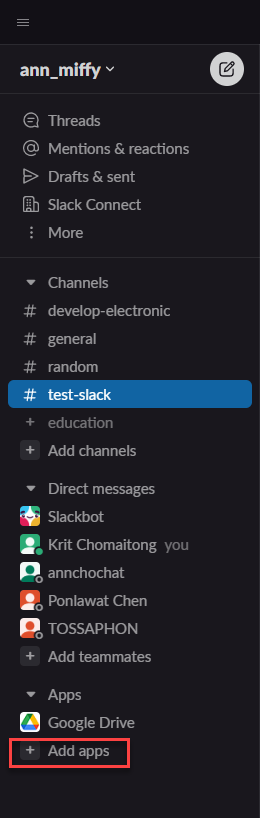
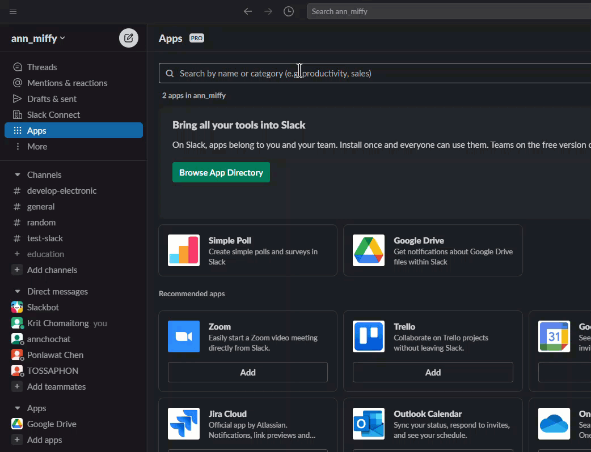

# 14. การทำ Poll ☑️❌ ด้วย Simple Poll

[Simple Poll](https://simplepoll.rocks/) เป็น App เสริมสำหรับ Slack ทำหน้าที่สร้าง Poll ให้เรา 

## การติดตั้ง

1. ให้ไปที่ด้านข้าง จะมีปุ่ม `+ Add apps` 



2.  พิมพ์ Simple Poll แล้วกด Enter



## การสร้าง Poll

ใช้คำสั่งด้านล่าง จะเป็นการสร้าง Poll แบบง่ายๆ

```
/poll "Which days work for you for the team dinner?" "Monday" "Tuesday" "Wednesday" "Thursday" "Friday"
```

รูปแบบของคำสั่ง 

1. /poll คือคำสั่ง
2. `"Which days work for you for the team dinner?"` เป็นคำถาม
3. `"Monday" "Tuesday" "Wednesday" "Thursday" "Friday"` เป็นตัวเลือก (ใช้เว้นวรรค เพื่อเพิ่มตัวเลือก)

<video width="100%" class="rounded-lg shadow-xl" autoplay="" loop="" muted="" playsinline="">
              <source src="https://static-s3.simplepoll.rocks/videos/simplepoll-demo-aug-2020.webm" type="video/webm">
              <source src="https://static-s3.simplepoll.rocks/videos/simplepoll-demo-aug-2020-compressed.mp4" type="video/mp4">
            </video>

