# 15. การเชื่อมต่อ 💬 Google Sheet ️📊 ด้วย Sheet.chat

ด้วยความสามารถที่หลากหลาย [[001-slack-คืออะไร|Slack]] สามารถเชื่อมต่อกับ Google Sheet ที่เรากำหนดไว้ได้ โดยผ่าน Apps ตัวกลางที่ชื่อว่า [Sheet.chat](https://sheet.chat)

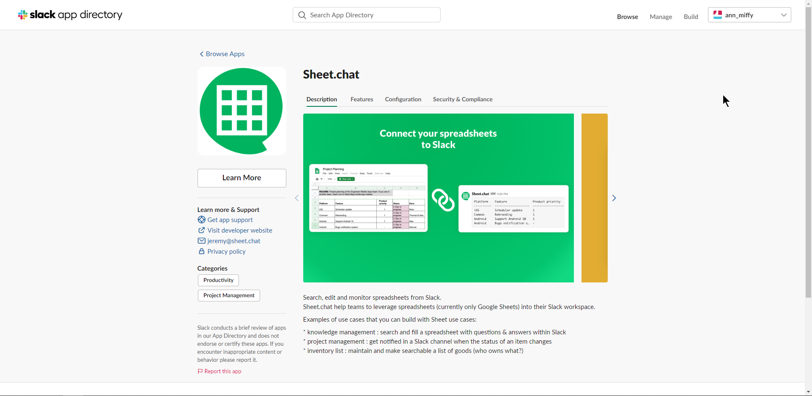{loading=lazy}

## ขีดจำกัดของตัวฟรี

- ข้อมูลใน sheet จะต้องไม่เกิน 200 บรรทัด
- จำกัดการใช้ Google Sheet แค่ 2 อัน

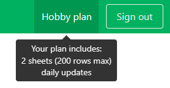{loading=lazy}

## การใช้งาน Sheet.chat 

1. ไปที่ [https://sheet.chat/](https://sheet.chat/)

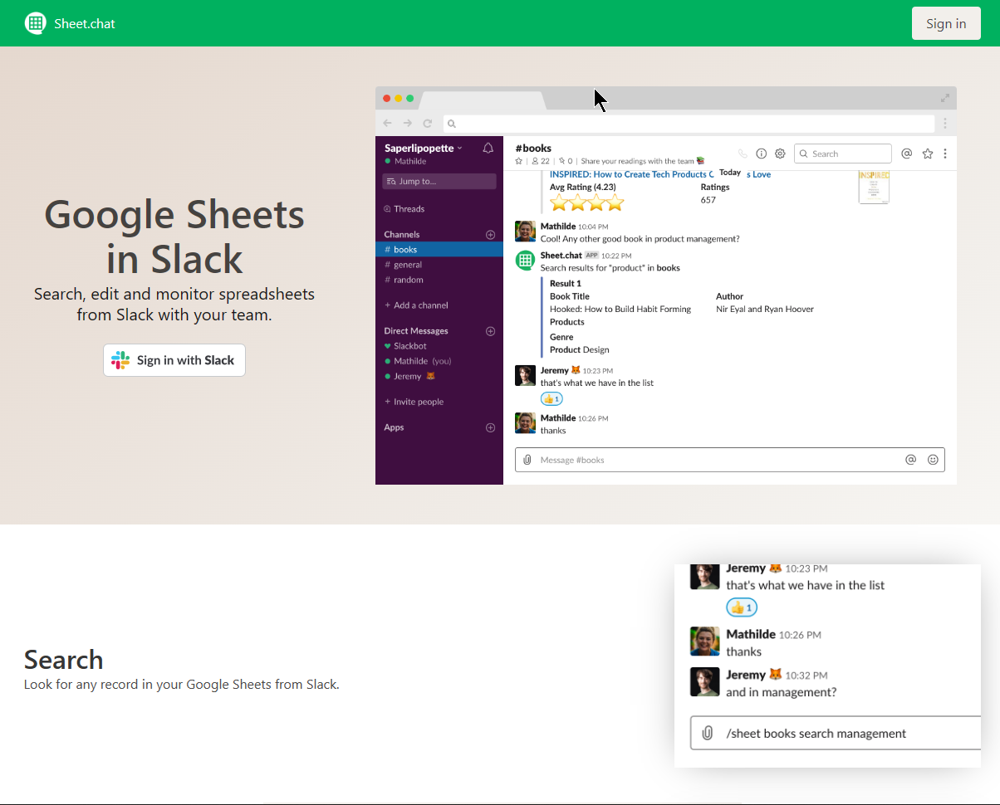{loading=lazy}

2. กดปุ่ม `Sign in` 

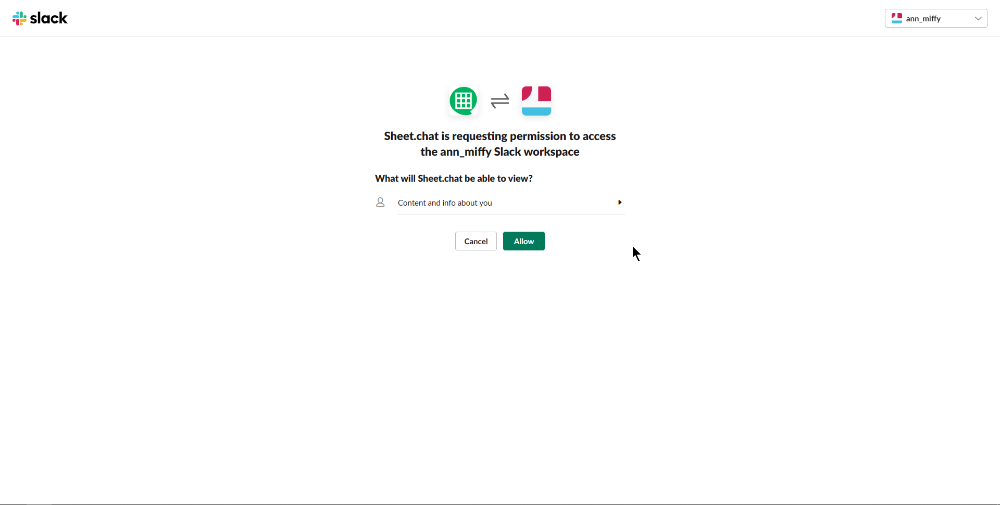{loading=lazy}

3. กดปุ่ม `Allow` เพื่อเชื่อมต่อ Sheet.chat กับ Slack

4. ตัว Sheet.chat จะบอกขั้นตอนในการติดตั้ง 3 ขั้นตอน

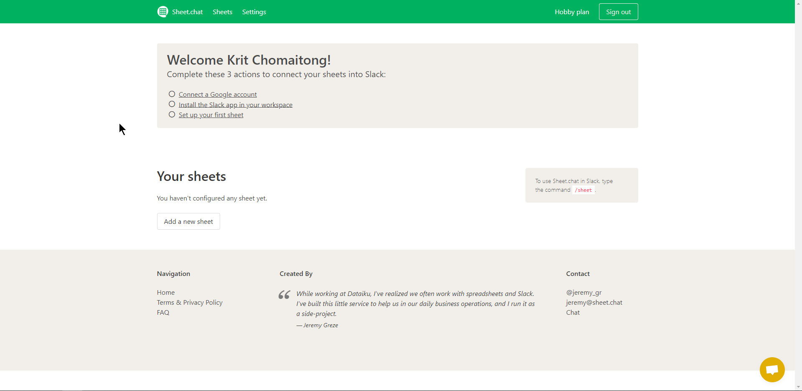{loading=lazy}

5. เสร็จแล้วกด `Connect a Google account` เพื่อ Sheet.chat จะทำการเชื่อมต่อกับ Google Sheet ผ่าน Google Account

{loading=lazy}

6. แล้วกด `Allow` ให้ Sheet.chat เพื่อเชื่อมต่อ Google Account โดยบอกเงื่อนไขดังกล่าว

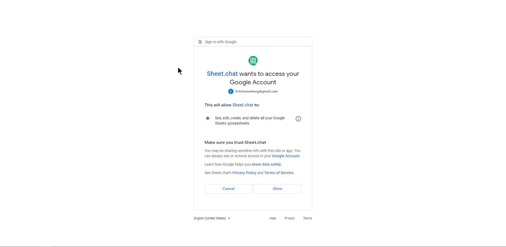{loading=lazy}

7. Sheet.chat จะบอกขั้นตอนต่อไป 

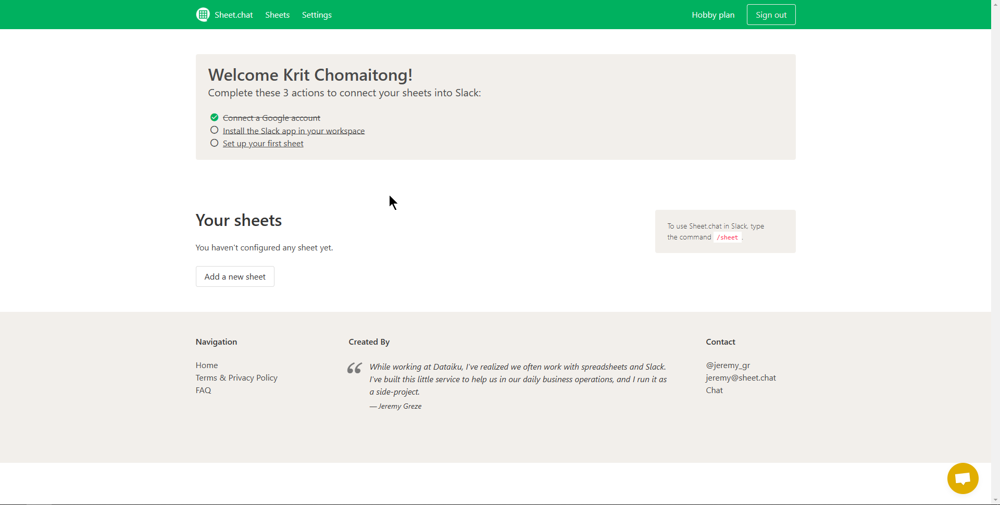{loading=lazy}

8. กด `Install the Slack app in your workspace` แล้วจะปรากฎดังรูปด่านล่าง

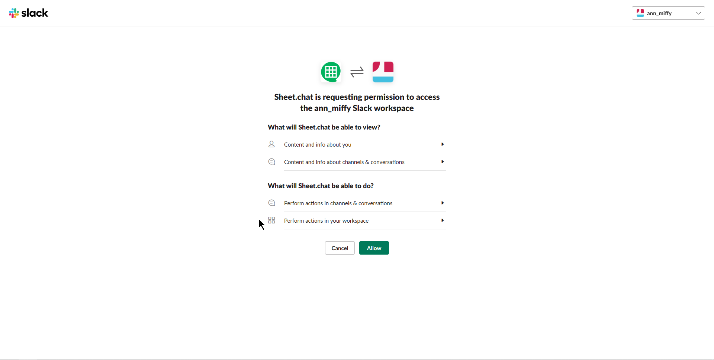{loading=lazy}

9. กด `Allow` เพื่ออนุญาติให้ Sheet.chat เชื่อมต่อกับ Slack ได้

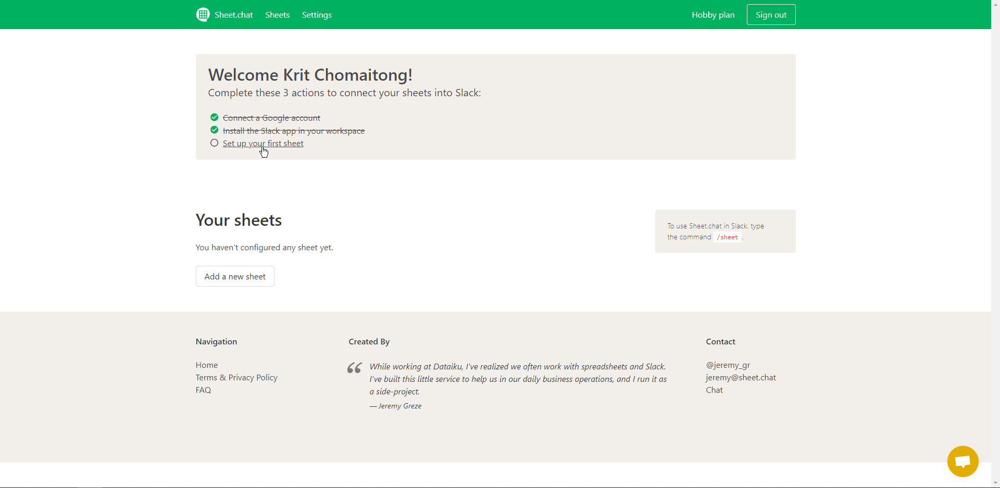{loading=lazy}

10. ให้เราเตรียม Google Sheet ขึ้นมา

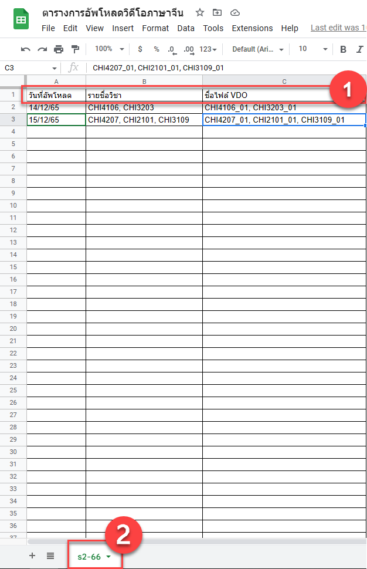{loading=lazy}

10.1. ใน Google Sheet ต้องมีบรรทัดแรกเป็นข้อมูลหัวตารางเสมอ โดยจะมีกี่ column ก็ได้
10.2. ชื่อของ Sheet จะต้องเป็นภาษาอังกฤษ

11. กด `Setup your first sheet` จะปรากฎหน้าจอให้เรากรอกรายละเอียด URL ของ Google Sheet

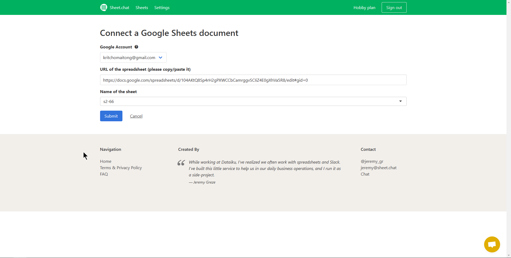{loading=lazy}

12. กรอก URL ของ Google Sheet แล้วเลือก Sheet ที่เราจะให้ข้อมูลกรอกลงไป แล้วกด `Submit`

13. Sheet.chat จะให้เราตั้งค่าเพิ่มเติม 

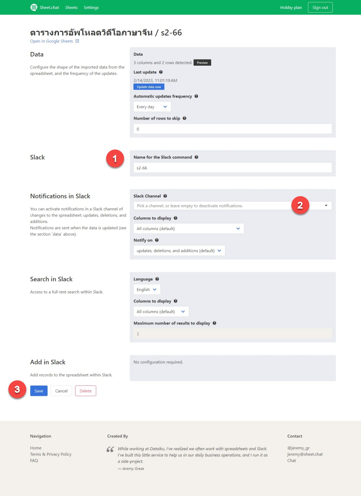{loading=lazy}

13.1. ชื่อของ Sheet จะกลายเป็นคำสั่งใน slack

13.2. ให้เราเลือก channel ที่จะเป็นตัวแจ้งเตือน

13.3. กด `Save` เพื่อบันทึก

14. Sheet.chat จะแสดงให้เห็นว่าเรามี Google Sheet ที่ผูกกับ Slack อยู่กี่อัน

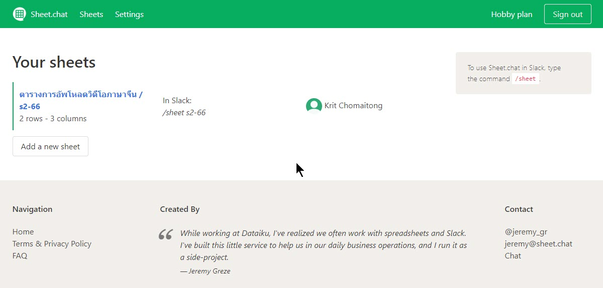{loading=lazy}

